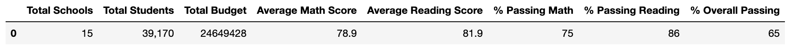
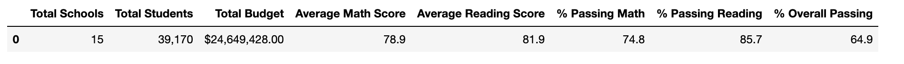
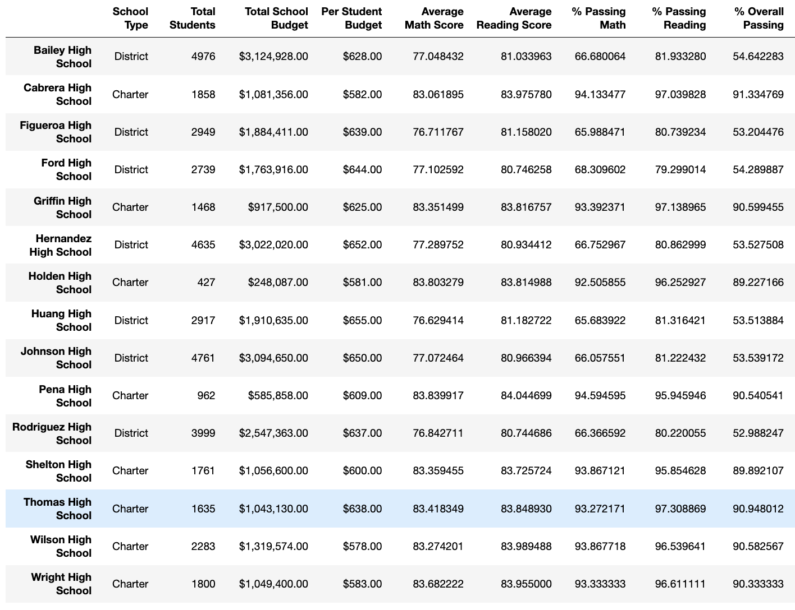
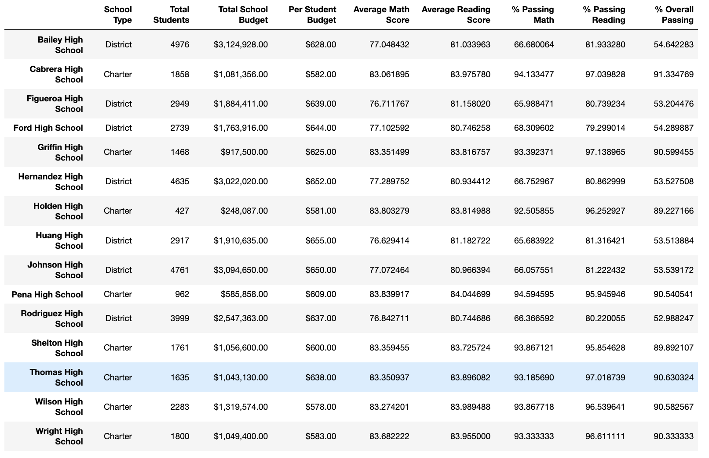

# School_District_Analysis_Challenge

## Overview/Purpose of the Project:
   * The purpose of this project was to assist Maria and the schoolboard in correcting academic dishonesty. This was done by replacing Thomas Highschool's math and reading scores with NaNs and repeating the school district analysis we previously conducted. The following report describes how these changes affected the overall analysis.
   
## The Results:
   *  How is the district summary affected?
      * As seen in the images below, replacing Thomas High School's math and reading scores with NaNs had a **minimal** impact on the district summary. More specifically, if we were to round to the nearest whole number, the summaries would be identical. See below. 
        * Previous District Summary:
        
        
        * New District Summary:
        
        
   * How is the school summary affected?
     * After changes were made to Thomas High School, we can see a slight decrease in % Passing Reading, & Passing Math, and % Overall Passing. Each of the aforementioned categories decreased by at least .1%. See below images for details. 
     
       * Previous School Summary:
       
       * New School Summary
       * 
